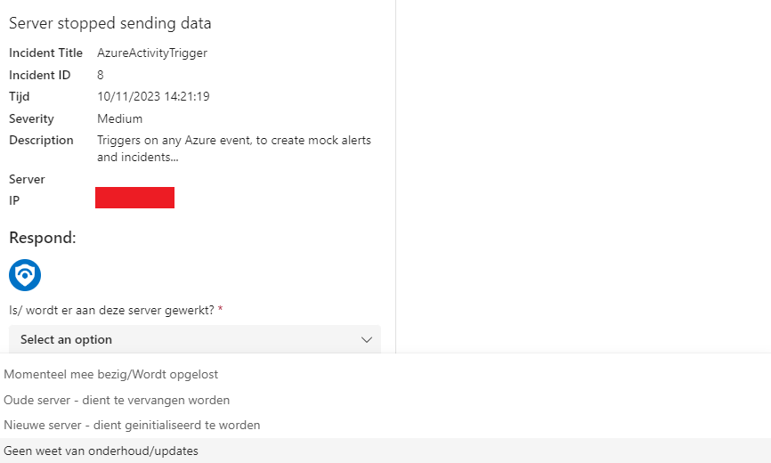
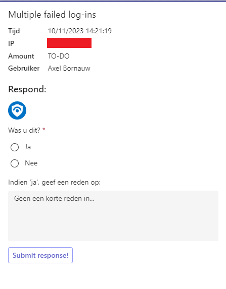
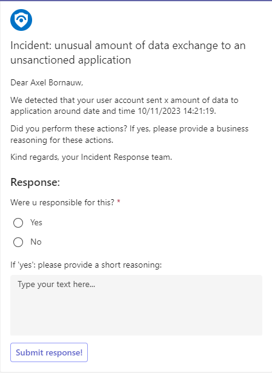
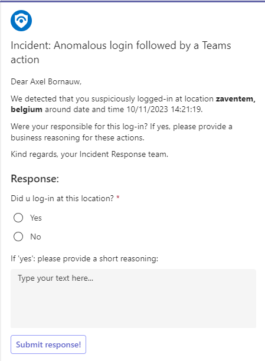

# MS Teams templates

# Inhoudstafel:
1. [ESXI Server](#esxi)
2. [MultipleLoginsFailed](#multiplelogins)
3. [Unsanctioned Cloud App](#unsactioned)
4. [Anomalous Login](#anomalouslogin)

## ESXI Server

## MultipleLoginsFailed

## Unsanctioned Cloud App

## Anomalous Login
